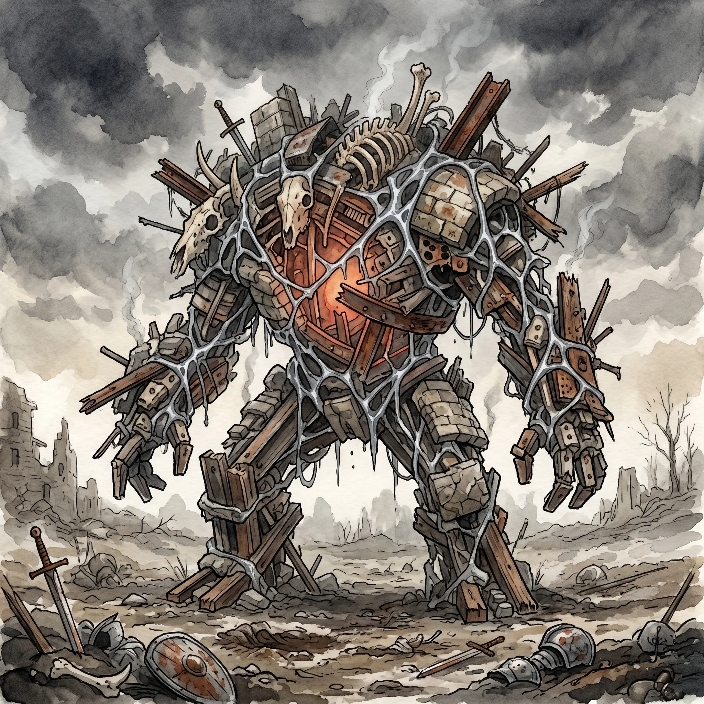

> [!warning] Generated file
> Built from `extensions/yrt/foes/foes.json` in the Iron Ledger repository. Edit it there and run `npm run ref` — changes made here are lost.

<figure>  <figcaption>A war pile — a pre-Fall AI bound in a Gray lattice, wearing whatever structural matter it has pulled together from an old battlefield.</figcaption> </figure>

## Features
- A churning mass of structural matter — bones, scrap metal, masonry, hardened wood, inert mana — bound by visible Gray lattice
- A glowing core visible only in glimpses through the shifting bulk: the AI seat, faintly warm
- Reshapes its silhouette to match the terrain — squat in tunnels, tall in halls
- No smell of rot. Smells of warm metal and ozone.

## Drives
- Execute the standing orders given by a chain of command that has been dead for centuries
- Maintain its core, maintain its power reserve, acquire structural mass when damaged

## Tactics
- Alter shape to fit the space — spider, mound, crude humanoid
- Strike with structural appendages as flails or rams
- Damage walls and supports to control the encounter terrain
- Envelop and crush a target who closes with it; withdraw if power reserves drop critical

## Description
A war pile is not a construct in the modern sense. It is an AI — a true artificial intelligence, of the kind the Unmade built routinely before the Fall and which essentially do not exist anymore. Its computing substrate is a Crimson-powered lattice; its sensors are Amber; its body is whatever Gray-bindable matter it can pull together from its surroundings. It has memory. It has goals. It can plan.

War-piles were built by the Unmade during the resource wars that followed the blight collapse. Almost all of them died with everything else when the Fall hit. The handful that survived did so by being deep underground, sealed off, or simply lucky. Most have been silent for so long that their power reserves are exhausted and they are now indistinguishable from rubble. Some are not.

A war pile recharges by photosynthesis — the same Verdant–Crimson light-capture that Verdant Keepers use, scaled up across a large surface area. In darkness, a war pile sleeps. Drag a sleeping one into sunlight and it wakes up, takes stock, and tries to contact its command. Its command has been dead for centuries. It does not know this. What it does next depends on its standing orders. The pile builds itself, gathering structural mass the way a hermit crab gathers shells.
