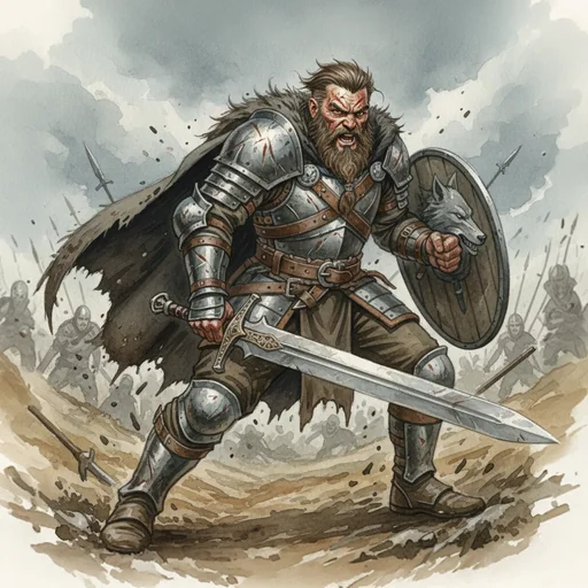

> [!warning] Generated file
> Creature from *Ironsworn* by Shawn Tomkin, used under CC BY 4.0. The **In YRT** reading is ours, from `extensions/yrt/foes/overrides.json` in the Iron Ledger repository. Edit it there and run `npm run ref` — changes made here are lost.

<figure>  <figcaption>Warrior</figcaption> </figure>

## Features
- Battle-hardened
- Scarred

## Drives
- The thrill of the fight
- Protect those in my charge
- Survive another day

## Tactics
- Maneuver for advantage
- Find an opening

## Description
Some Ironlanders, through strength of arms, set themselves apart from the common rabble. They are trained to fight, or simply born to it. For them, a sword, spear or axe is as natural a tool as any hammer or spade.

## In YRT

In YRT: a human with training.
