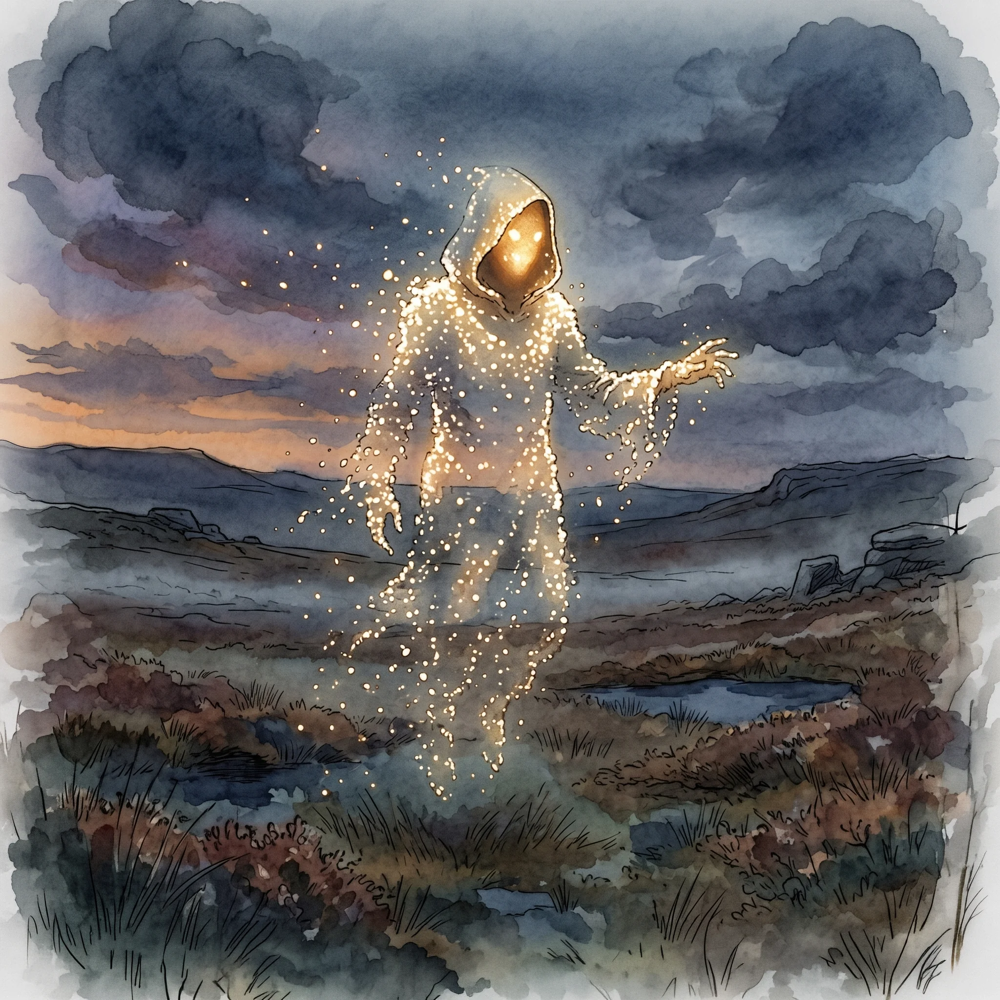

> [!warning] Generated file
> Built from `extensions/yrt/foes/foes.json` in the Iron Ledger repository. Edit it there and run `npm run ref` — changes made here are lost.

<figure>  <figcaption>A wisp walker — a self-organising cloud of Amber and Luminous particles, shaped into humanoid form by the observer's own neural pattern.</figcaption> </figure>

## Features
- A coalescing cloud of golden-white particles, vaguely humanoid or animal-shaped
- Silent; communicates by gesture and apparent direction
- Slow, beckoning movement
- Cannot be touched — the form disperses and reforms

## Drives
- Drift toward the nearest source of warmth and motion

## Tactics
- Appear to a lost or desperate traveller and gesture toward a path
- Lead the traveller into a blight zone, deeper water, or an unstable ruin
- Disperse on contact, then reform after the traveller has committed to following

## Description
A wisp walker is a self-organising cloud of unbound Amber and Luminous particulates, drifting on local mana currents. Most form near the edges of long-quiet blight zones, where the leak is slow and steady enough to support a stable suspension.

The shape is not deliberate. The particles cohere along the line of strongest Amber resonance, and the strongest Amber resonance in the area is almost always the brain of whoever is looking at it. The wisp adopts a humanoid form because that's what the observer's neural pattern keeps suggesting to it — feedback loop, not design.

The "guidance" is the same effect. The cloud drifts toward warmth and motion. The observer interprets this as the wisp pointing somewhere and leading the way. They follow. The wisp continues drifting toward the next warm thing, which is usually deeper into the blight zone the wisp came from. Eventually the traveller is somewhere they should not be, and the wisp has dispersed because the local Amber concentration has equalised.
