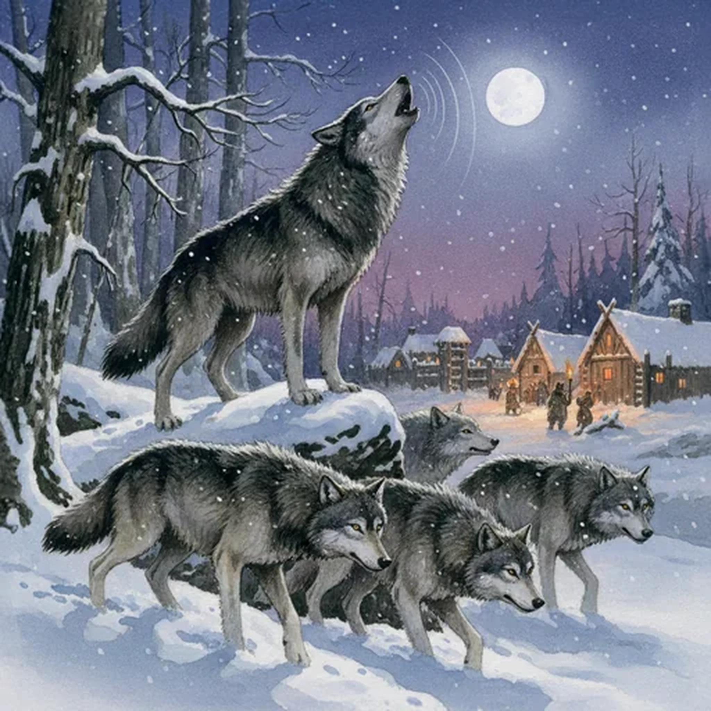

> [!warning] Generated file
> Creature from *Ironsworn* by Shawn Tomkin, used under CC BY 4.0. The **In YRT** reading is ours, from `extensions/yrt/foes/overrides.json` in the Iron Ledger repository. Edit it there and run `npm run ref`. Changes made here are lost.

<figure>  <figcaption>Wolf</figcaption> </figure>

## Features
- Keen senses

## Drives
- Fight rivals
- Mark territory
- Run with the pack

## Tactics
- Stalk
- Pack rush
- Drag to the ground

## Description
The Ironlands are home to several breeds of wolves. Most are not aggressive and stay clear of settlements and travelers. Despite that, attacks against Ironlanders are not unknown. A harsh winter and insufficient prey can drive a pack to hunt livestock or even an unwary Ironlander. As night falls we hear their howls, and hope they are well fed.

## In YRT

In YRT: a wolf.
