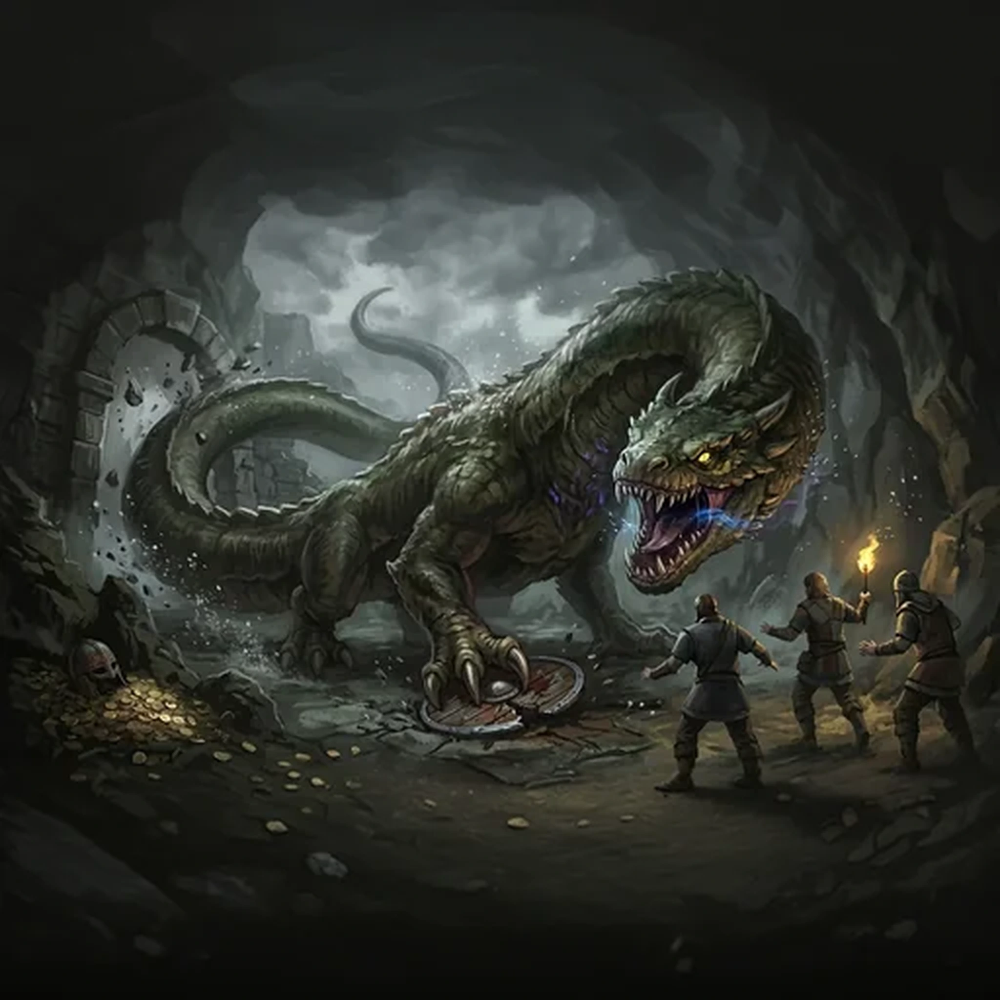

> [!warning] Generated file
> Creature from *Ironsworn: Delve* by Shawn Tomkin, used under CC BY 4.0. The **In YRT** reading is ours, from `extensions/yrt/foes/overrides.json` in the Iron Ledger repository. Edit it there and run `npm run ref`. Changes made here are lost.

<figure>  <figcaption>Wyrm</figcaption> </figure>

## Features
- Enormous size
- Yellow eyes, bright as a torch
- Long, sinuous tail
- Scaled skin
- Cavernous mouth

## Drives
- Protect territory
- Kill and feed

## Tactics
- Tail smash
- Pin to the ground
- Savage claw and bite

## Description
Wyrms are massive serpentine creatures. They are kin to the wyverns, but are much larger and wingless. Their lairs are found in deep caves, subterranean vaults, or at the heart of dense forests. They hibernate in those places for weeks or months at a time, waking only to satiate their massive appetites. They are low-slung beasts, with short, thick legs, elongated jaws, and a dense hide.

Fiercely territorial, a wyrm is sure to attack any who stray into their domain. It can sense movement through vibration, and its golden eyes can pierce the thickest darkness.

## In YRT

In YRT: a mundane very large serpent; 'eyes piercing the thickest darkness' is excellent night vision. Optional Verdant-tinted longevity and Crimson trace in the eyes for the torchlight gaze.
