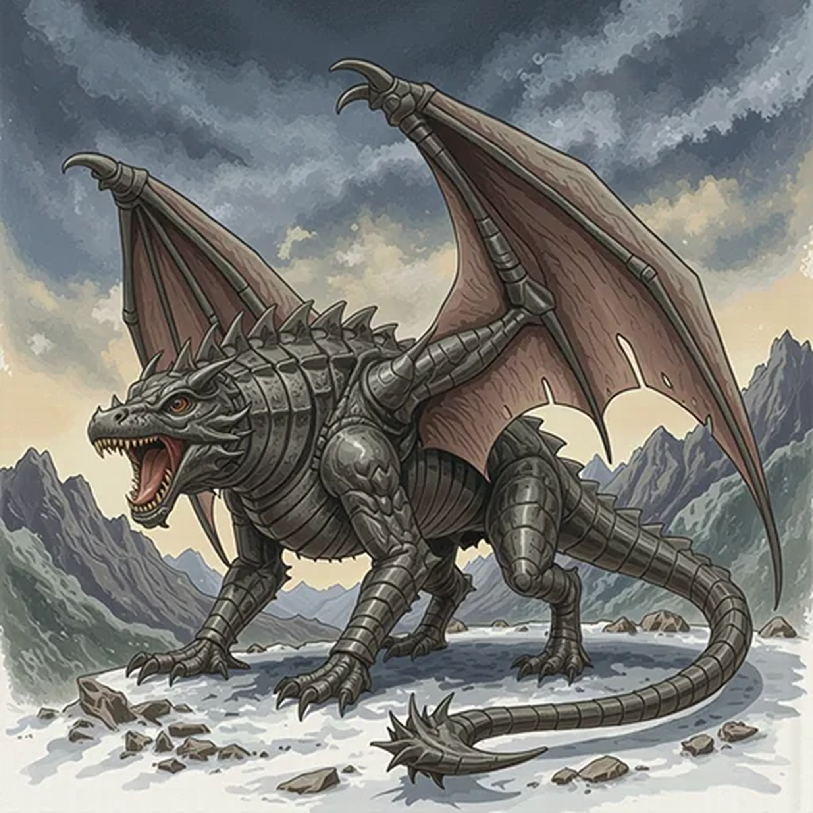

> [!warning] Generated file
> Creature from *Ironsworn* by Shawn Tomkin, used under CC BY 4.0. The **In YRT** reading is ours, from `extensions/yrt/foes/overrides.json` in the Iron Ledger repository. Edit it there and run `npm run ref` — changes made here are lost.

<figure>  <figcaption>Wyvern</figcaption> </figure>

## Features
- Huge bat-like wings
- Rows of teeth each the size of a knife
- Thick hide with a metallic sheen
- Long tail

## Drives
- Watch for prey from high above
- Feed

## Tactics
- Swoop down
- Snap up prey
- Fearsome roar
- Bash with tail

## Description
There are several breeds of wyverns in the Ironlands. To the west, tawny wyverns nest in the cliffs of the Barrier Islands and Ragged Coast, diving for fish in the surrounding waters. Inland, the verdant wyverns dwell in forested regions. The largest and most fearsome breed, the iron wyverns, hunt among the Tempest Hills and along the flanks of the [Veiled Mountains](classic/atlas/ironlands/veiled_mountains).

All wyverns have wolfish heads with wide jaws, thick bodies, and sinuous tails. They have short hind limbs and elongated forelimbs which extend along their wings. In flight, they are a terrifying but awe-inspiring creature. On the ground, they lumber heavily on all four limbs, their wings folded back, jaws agape, gaze fixed on their prey. They are the grim cruelty of the Ironlands given form. They are death.

## In YRT

In YRT: a mundane winged flying reptile. The three breeds map to regional mana exposure: tawny (none), verdant (trace Verdant hide, deeper forest), iron (Gray-infused dermal plates — the metallic sheen is literal). None supernatural.
