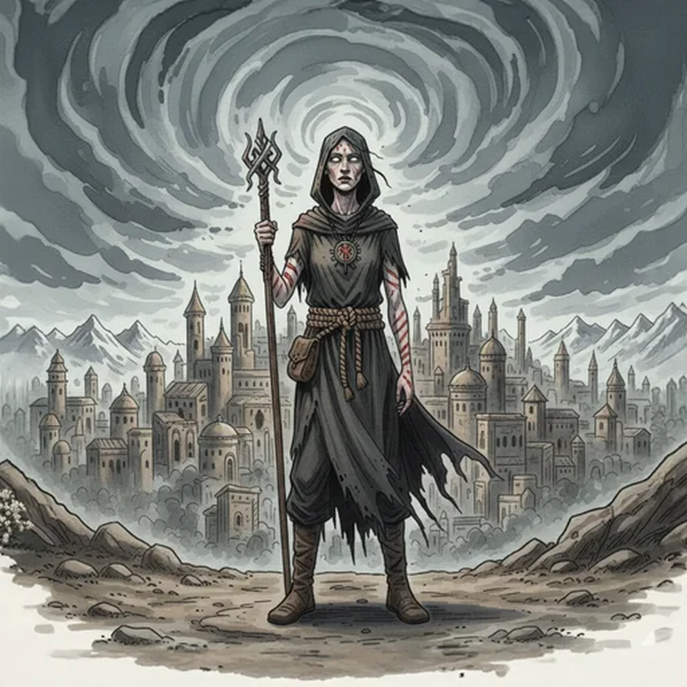

> [!warning] Generated file
> Creature from *Ironsworn: Delve* by Shawn Tomkin, used under CC BY 4.0. The **In YRT** reading is ours, from `extensions/yrt/foes/overrides.json` in the Iron Ledger repository. Edit it there and run `npm run ref`. Changes made here are lost.

<figure>  <figcaption>Zealot</figcaption> </figure>

## Features
- Sickly pallor
- Distant eyes
- Marks of their faith

## Drives
- Serve the faith
- Bring others into the fold
- Destroy those who oppose them

## Tactics
- Entice with trickery or false promises
- Use the powers of the faith
- Stand together to overcome nonbelievers

## Description
Zealots are those we have lost to their faith. Friends and loved ones are discarded or forgotten. Communities are left behind. Possessions are discarded or turned over to the needs of the sect. They live for one purpose, and all other vows are forsaken. This single-minded devotion changes them, sometimes irrevocably.

Some zealots worship ancient, forgotten gods, and seek to return them to their former horrible glory. Others serve new religious movements, caught up in promises of a better life. Some worship mortal leaders as if they were gods—perhaps even believing them to be the avatar of divinity.

This sense of belonging, of purpose, can be a powerful lure in this perilous land.

## In YRT

In YRT: ordinary religious fanatics, entirely human. 'Powers of the faith' are crude stolen or black-market mana seeds — common-use flares, panic wards, or smuggled Crimson seeds from a sympathetic artificer.
